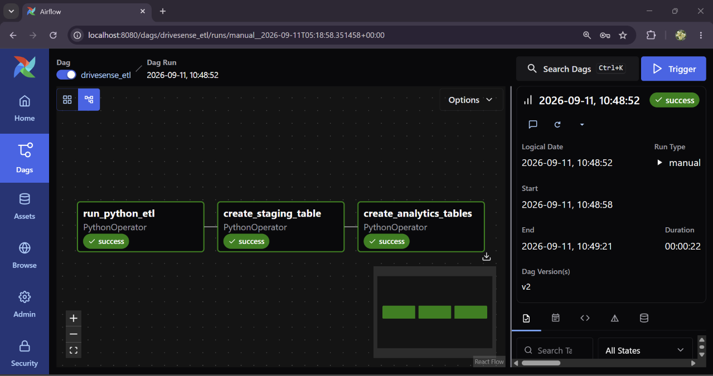
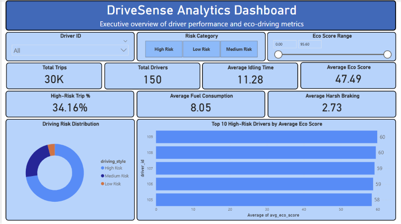
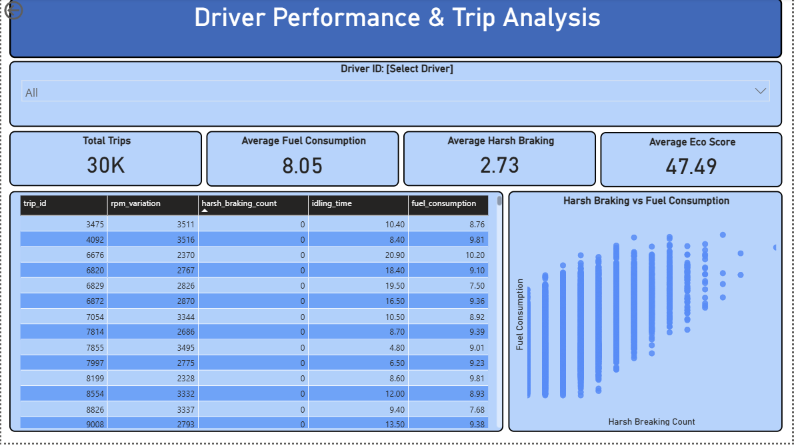

# 🚗 DriveSense Analytics ETL Pipeline

An end-to-end Data Engineering project that automates the ingestion, transformation, and analytics of eco-driving data using **Apache Airflow**, **Python**, **PostgreSQL**, **Docker**, and **SQL**.

The pipeline extracts driving behavior data from a CSV dataset, validates it, loads it into PostgreSQL, performs SQL-based transformations, and generates analytics-ready tables for reporting and visualization.

---

## 📌 Project Architecture

```
                +----------------------+
                | Eco Driving CSV File |
                +----------+-----------+
                           |
                           v
                 Python ETL Pipeline
          (Extract → Validate → Load)
                           |
                           v
               raw_eco_driving (PostgreSQL)
                           |
                           v
                SQL Transformation Layer
                           |
                           v
                stg_eco_driving
                  /             \
                 /               \
                v                 v
     agg_driver_summary     anomaly_trips
                 \               /
                  \             /
                   v           v
                  Power BI Dashboard
```

---

# 🚀 Tech Stack

- Python
- Apache Airflow 3
- PostgreSQL
- SQL
- Docker & Docker Compose
- Pandas
- SQLAlchemy
- Power BI

---

# 📂 Project Structure

```
DriveSense-Analytics/
│
├── airflow/
│   ├── dags/
│   ├── logs/
│   ├── plugins/
│   └── config/
│
├── data/
│   └── eco_driving_score.csv
│
├── postgres/
│   └── init.sql
│
├── sql/
│   ├── 01_create_raw_table.sql
│   ├── 02_create_staging_table.sql
│   └── 03_create_analytics_tables.sql
│
├── tasks/
│   ├── extract.py
│   ├── validate.py
│   ├── load.py
│   ├── pipeline.py
│   ├── execute_sql.py
│   └── sql_tasks.py
│
├── notebooks/
├── powerbi/
├── screenshots/
├── docker-compose.yml
├── Dockerfile
├── requirements.txt
├── README.md
└── .gitignore
```

---

# ⚙️ ETL Workflow

### Step 1 – Extract

- Reads eco-driving dataset from CSV.
- Loads data into a Pandas DataFrame.

---

### Step 2 – Validate

- Checks for missing values.
- Performs data quality validation.
- Ensures clean records before loading.

---

### Step 3 – Load

Validated data is loaded into PostgreSQL.

**Table**

```
raw_eco_driving
```

---

### Step 4 – Staging

Creates a staging table using SQL.

Features:

- Generates unique Trip IDs
- Groups similar drivers using `NTILE(150)`
- Creates cleaned staging data

**Table**

```
stg_eco_driving
```

---

### Step 5 – Analytics

Creates analytics tables.

## Driver Summary

```
agg_driver_summary
```

Contains:

- Driver ID
- Total Trips
- Average Eco Score
- Average Fuel Consumption
- Average Harsh Braking
- Average Idling Time

---

## Anomaly Detection

```
anomaly_trips
```

Flags trips with:

- Low Eco Score
- High Harsh Braking
- Abnormally High Fuel Consumption

---

# 📊 Database Flow

```
CSV
 │
 ▼
raw_eco_driving
 │
 ▼
stg_eco_driving
 │
 ├──────────────► agg_driver_summary
 │
 └──────────────► anomaly_trips
```

---

# 📈 Airflow DAG

The ETL pipeline is orchestrated using Apache Airflow.

```
run_python_etl
        │
        ▼
create_staging_table
        │
        ▼
create_analytics_tables
```

Each task executes independently, making the workflow modular and easy to monitor.

---

# 📊 Results

Successfully generated:

| Table | Description |
|--------|-------------|
| raw_eco_driving | Raw imported dataset |
| stg_eco_driving | Cleaned staging table |
| agg_driver_summary | Driver-level aggregated metrics |
| anomaly_trips | Trips identified as anomalies |

---

## 📊 Dashboard

A Power BI dashboard was created to visualize the processed ETL data and provide meaningful insights into driver performance, trip behavior, and anomalies.

### Dashboard Highlights

- Driver performance analysis
- Total trips and sales metrics
- Anomaly trip identification
- Regional/driver-level insights
- Interactive filters for deeper analysis
---

# 🐳 Running the Project

Clone the repository

```bash
git clone https://github.com/yourusername/DriveSense-Analytics.git
```

Navigate to the project

```bash
cd DriveSense-Analytics
```

Start Docker

```bash
docker compose up -d
```

Open Airflow

```
http://localhost:8080
```

Default Credentials

```
Username: admin
Password: admin
```

Trigger the DAG

```
drivesense_etl
```

---

## 📸 Project Screenshots

### Airflow ETL Pipeline

The Airflow DAG orchestrates the complete ETL workflow, including data extraction, staging table creation, and analytics table creation.



### Power BI Dashboard

The Power BI dashboard provides an interactive view of driver performance and trip analysis, including KPIs, fuel consumption, harsh braking, eco score, and driver-level filtering.


 

---

# 👩‍💻 Author

**Pragya Pradhan**

- GitHub: https://github.com/Pragya-Pradhan-ds
---